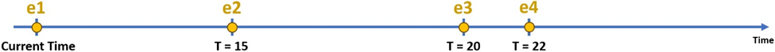
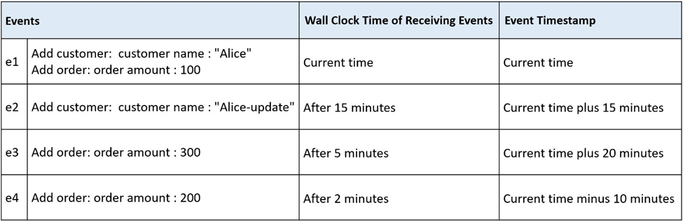

# Versioned state store in Kafka Streams(Kafka 3.5+) Demo

## Overview
This repository has two topologies, 
[topology utilizing versioned store](./src/main/java/space/zeinab/demo/kafka/topology/VersionedTopology.java) and 
[topology utilizing unversioned store](./src/main/java/space/zeinab/demo/kafka/topology/UnVersionedTopology.java),
and demonstrates
* How to implement a table-to-table join in the DSL, with both tables materialized by versioned store. [source](./src/main/java/space/zeinab/demo/kafka/topology/VersionedTopology.java)  .
* Compare the different behavior between *versioned* and *unversioned* state stores when handling out-of-order data

## Prerequisites
* Java 17 or higher
* Maven
* Docker (optional, for running Docker Compose which include Zookeeper and Apache Kafka)

## Running the Application
1. **Clone the repository**
   ```sh
   git clone <repository-url>
   cd spring-boot-kafka-streams-versionedStateStore-demo
   ```

2. **Start Kafka and Zookeeper by using Docker Compose file in the repository**:
   ```sh
   docker-compose up
   ```

3. **Build**:
   ```sh
   mvn clean install
   ```

4. **Run the application**

   ```sh
   mvn spring-boot:run
   ```

5. **Produce dummy data to test the application with out-of-order data**

Run the application and [produce dummy data](./src/main/java/space/zeinab/demo/kafka/producer/MockOutOfOrderDataProducer.java) including out-of-order data
to observe the different behavior between versioned and unversioned state stores when handling out-of-order data.

Dummy data includes 4 events in the following specific order for both versioned and unversioned store:





Event e4 arrives out-of-order after arriving event e3, but with a timestamp that is older than e3.

In versioned state stores, the join operation reflects the latest record by timestamp, not by arrival order. Therefore, the most recent data by timestamp (i.e., e3) will remain the valid record, even though e4 was processed later. This ensures that out-of-order data does not incorrectly overwrite the latest accurate state.
* [Output stream]: customer1, Utilizing versioned store --> Customer: Alice-update placed order worth 300

However, in unversioned key-value store, e4 incorrectly be treated as the most recent record because it was received later, leading to inaccurate join results.
* [Output stream]: customer1, Utilizing unversioned store --> Customer: Alice-update placed order worth 200

These outputs shows using versioned store helps to implement more accurate application by handling out-of-order data accurately.